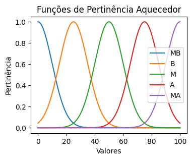

# Crescimento-de-Tomates
O cultivo de tomates em estufas oferece vantagens significativas devido ao ambiente controlado, permitindo condições ideais de crescimento, como regulação de temperatura, umidade e luz. Esse método garante a produção de frutos de alta qualidade, com uniformidade em tamanho, cor e sabor, além de reduzir a incidência de pragas e doenças. Embora existam desafios como investimentos iniciais elevados, salinização do solo e manejo da polinização, o cultivo em estufas aumenta a produtividade e a sustentabilidade. Além disso, dados meteorológicos reais do INMET auxiliam em ajustes precisos do ambiente, otimizando ainda mais os rendimentos dos tomates. Este estudo examina a escolha do tomate e explora fatores limitantes no cultivo em estufas para práticas agrícolas aprimoradas.
## Introdução
O trabalho tem como objetivo utilizar controladores fuzzy para problemas reais,no caso para plantações e estufas agricolas.

Controladores fuzzy podem ser usados em estufas para melhorar o controle ambiental, garantindo condições ideais para o crescimento das plantas. Eles utilizam lógica fuzzy para lidar com incertezas e variabilidades dos parâmetros ambientais, como temperatura, umidade, luz e níveis de dióxido de carbono.

Por exemplo, em vez de trabalhar com limites rígidos, o controlador fuzzy avalia situações intermediárias, como "umidade moderada" ou "temperatura ligeiramente alta", e ajusta os sistemas de aquecimento, ventilação, irrigação ou sombreamento de forma contínua e adaptativa. Isso permite uma resposta mais eficiente e precisa às mudanças nas condições externas, otimizando o consumo de recursos, como água e energia, e promovendo um ambiente mais estável para o cultivo.
## Metodologia
Através de dados meteorológiocs obtidos no site do INMET (Instituto Nacional de Meteorologia), extraimos o dados a cada hora de temperatura média (Cº), humidade média do ar (\%) e radiação solar (kJ/m2), agrupando os mesmos em estações e meses.

<table>
    <tr>
        <td>Função de Pertinência Erro Temperatura</td>
        <td>Função de Pertinência Erro de Variação de Temperatura</td>
    </tr>
    <tr>
        <td></td>
        <td></td>
    </tr>
    <tr>
        <td>Função de Pertinência Erro Umidade</td>
        <td>Função de Pertinência Radiação</td>
    </tr>
    <tr>
        <td></td>
        <td></td>
    </tr>
</table>

Com estes dados, foram propostas uma série de regras de inferência fuzzy, que definem o controle das condições climáticas dentro da estufa, regras apresentadas em \ref{regras} já alteradas manualmente durante testes com diferentes valores de acionamento dos atores.

| Temp + Humid |  Var. Temp |  Radiação |  Aque. / Humid. /Jan. |
|--------------|------------|-----------|-----------------------|
| NG + NG      |  (NG — NP) |  Baixa    |  MA / A / B           |
| NG + NG      |  PP        |  Média    |  MA / A / B           |
| NG + NG      |  (NG — NP) |  Baixa    |  MA / A / B           |
| NG + NG      |  PP        |  Média    |  MA / A / B           |
| NG + NG      |  PG        |  Alta     |  MA / A / B           |
| NG + NP      |  (NG — NP) |  Baixa    |  MA / A / M           |
| NG + NP      |  PP        |  Média    |  MA / A / M           |
| NG + NP      |  PG        |  Alta     |  MA / A / M           |
| NG + PP      |  (NG — NP) |  Baixa    |  MA / M / A           |
| NG + PP      |  PP        |  Média    |  MA / M / A           |
| NG + PP      |  PG        |  Alta     |  MA / M / A           |
| NG + PG      |  (NG — NP) |  Baixa    |  MA / MB / A          |
| NG + PG      |  PP        |  Média    |  MA / MB / A          |
| NG + PG      |  PG        |  Alta     |  MA / MB / A          |
| NP + NG      |  (NG — NP) |  Baixa    |  A / MA / B           |
| NP + NG      |  PP        |  Média    |  M / MA / M           |
| NP + NG      |  PG        |  Alta     |  B / MA / MA          |
| NP + NP      |  (NG — NP) |  Baixa    |  A / M / B            |
| NP + NP      |  PP        |  Média    |  M / M / M            |
| NP + NP      |  PG        |  Alta     |  B / A / MA           |
| NP + PP      |  (NG — NP) |  Baixa    |  A / MB / B           |
| NP + PP      |  PP        |  Média    |  M / B / M            |
| NP + PP      |  PG        |  Alta     |  B / M / MA           |
| NP + PG      |  (NG — NP) |  Baixa    |  A / MB / B           |
| NP + PG      |  PP        |  Média    |  M / MB / M           |
| NP + PG      |  PG        |  Alta     |  B / MB / MA          |
| PP + NG      |  (NG — NP) |  Baixa    |  MB / MA / MA         |
| PP + NG      |  PP        |  Média    |  MB / MA / MA         |
| PP + NG      |  PG        |  Alta     |  MB / MA / MA         |
| PP + NP      |  (NG — NP) |  Baixa    |  MB / A / A           |
| PP + NP      |  PP        |  Média    |  MB / MA / MA         |
| PP + NP      |  PG        |  Alta     |  MB / MA / MA         |
| PP + PP      |  (NG — NP) |  Baixa    |  MB / MB / A          |
| PP + PP      |  PP        |  Média    |  MB / MB / MA         |
| PP + PP      |  PG        |  Alta     |  MB / MB / MA         |
| PP + PG      |  (NG — NP) |  Baixa    |  MB / MB / MA         |
| PP + PG      |  PP        |  Média    |  MB / MB / MA         |
| PP + PG      |  PG        |  Alta     |  MB / MB / MA         |
| PG + NG      |  (NG — NP) |  Baixa    |  MB / A / MA          |
| PG + NG      |  PP        |  Média    |  MB / A / MA          |
| PG + NG      |  PG        |  Alta     |  MB / A / MA          |
| PG + NP      |  (NG — NP) |  Baixa    |  MB / A / MA          |
| PG + NP      |  PP        |  Média    |  MB / A / MA          |
| PG + NP      |  PG        |  Alta     |  MB / A / MA          |
| PG + PP      |  (NG — NP) |  Baixa    |  MB / MB / MA         |
| PG + PP      |  PP        |  Média    |  MB / MB / MA         |
| PG + PP      |  PG        |  Alta     |  MB / MB / MA         |
| PG + PG      |  (NG — NP) |  Baixa    |  MB / MB / MA         |
| PG + PG      |  PP        |  Média    |  MB / MB / MA         |
| PG + PG      |  PG        |  Alta     |  MB / MB / MA         |

Utilizou-se um total de 48 regras, essas regras são uma junção lógica de "Erro de temperatura (Cº) AND Erro de humidade (\%) AND (Erro de variação de temperatura (Cº/min) OR Radiação (Wh))", cada uma dessas regras produz um resultado fuzzy para a porcentagem de funcionamento do Aquecedor, do humidificador e da abertura das janelas.

Para sabermos a interferência da radiação na temperatura, podemos descobrir um valor constante para transformar Wh ($x$) em Cº ($ \Delta  T$), a partir da taxa de absorção de calor do ar ($\mu$), calor específico do ar ($c$), densidade do ar ($\rho$) e a taxa de conversão de Wh para kJ ($3,6$), usando valores de literatura temos:

$
    \Delta  T=x\frac{\mu\times 3,6}{\rho\times c}=\frac{0,8\times 3,6}{1,225\times 1005}=0,002339323
$

## Resultados
Após jogarmos os dados separados por mês e estação, conseguimos obter os melhores resultados (resultados com menor erro de temperatura e humidade), obtivemos para Carmópolis de Minas Outubro como melhor mês e primavera como melhor estação:

<table>
    <tr>
        <td>Melhor Mês de Carmópolis - Outubro</td>
        <td>Melhor Estação de Carmópolis - Primavera</td>
    </tr>
    <tr>
        <td></td>
        <td></td>    
    </tr>
</table>

E para Jaíba novembro como melhor mês e verão como melhor estação:

<table>
    <tr>
        <td>Melhor Mês de Jaíba - Novembro</td>
        <td>Melhor Estação de Jaíba - Verão</td>
    </tr>
    <tr>
        <td></td>
        <td></td>    
    </tr>
</table>

Além dos resultados gráficos, também obtivemos valores mais concretos para os ajuste de cada ator, sendo eles:

- Aquecedor: 13 graus por hora
- Umidificador: 20\% por hora
- Janela: -13 graus por hora e -15\% de humidade por hora

E com as funções de pertinência de cada ator, definidas de 0 a 100\%

<table>
    <tr>
        <td>Função de Pertinência Aquecedor</td>
        <td>Função de Pertinência Umidade</td>
        <td>Função de Pertinência Janelas</td>
    </tr>
    <tr>
        <td></td>
        <td></td>
        <td></td>
    </tr>
</table>

Sendo os termos o grau de ativação do ator:
- MB - Muito baixo
- B - Baixo
- M - Medio
- A - Alto
- MA - Muito alto

## Conclusão

Neste trabalho, conseguimos ver como um sistema fuzzy pode ser utilizado de maneira real, através de dados coletados podemos simular como é o funcionamento de reguladores climatológicos em uma estufa.

Além disso, através do ajuste da pertinência de cada ator no resultado das regras fuzzy conseguimos obter um erro de temperatura calculada para temperatura desejada muito baixo em certas situações.

Temos de considerar que esse sistema utilizou dados de uma cidade inteira, não de um ponto fixo, portanto em casos específicos é importante ter isso em conta ao aplicar sistemas como este. Fora isso esse sistema foi testado em situações amenas, portanto as situações de Negativo Grande e Positivo Grande, podem ter imensa variação.

## Compilação
Para obter os resultados, basta apenas (no diretório) rodar o comando `python Tratamento_estufa.py` e em seguida `jupyter nbconvert --execute Estufa.ipynb --to notebook`
Testado com python 3.12

### Contato

<table>
    <tr> 
        <td>Gabriel Couto</td>
        <td>Gabriel Teixeira</td>
        <td>Marcus Vinícius</td>
    </tr>
    <tr>
        <td>
             
            
        </td>
        <td>
            
        </td>
        <td>
            
        </td>
    </tr>
</table>
